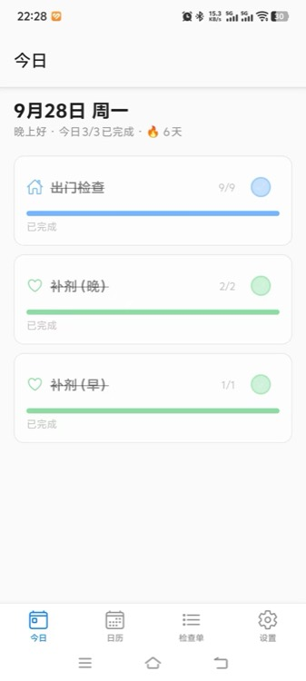
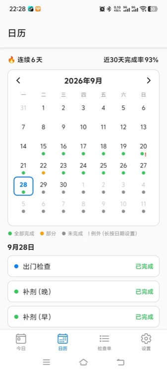

# 检查清单（check-list）

一款**个人单机**手机检查清单应用（iOS + Android 一套代码）。

核心结构是「检查单 → 分组 → 检查项」三层：手动勾选检查项，某次检查的所有项勾完时该次检查自动判定完成；检查单可按周期重复生成每日实例。

## 它解决什么问题

出门后反复怀疑「门锁了没」「煤气关了吗」，做事时想不起「这一步我到底做过没有」——这类不确定感没法靠记忆消除，只能靠**留痕**。

检查清单把「记不记得」变成「勾没勾」：

- **把怀疑换成一次确认**：每项只需勾选一次，勾了就算做过，没勾就是没做，不必再靠回忆反复推翻自己
- **把重复流程固化成清单**：每天出门、每周巡检、工作日例行事项按周期自动出现在今日列表，不需要每次重新回忆该查哪些
- **把「做过」留成可回看的历史**：日历能查任意一天各项的实际完成情况，连续天数与完成率直接给出趋势，而不是凭印象判断自己有没有落下
- **不打断当下的心流**：勾选即时写库、没有保存按钮、带触感反馈，一次确认只花一秒；临时休假日可按单个清单标记跳过或补做，不必改动整套周期规则

数据完全存在设备本地（SQLite）：无账号、无后端、无网络依赖，也不做多设备同步。

## 功能

- **检查单管理**：创建 / 编辑 / 归档 / 删除，支持分组与检查项的增删改与排序
- **重复周期**：一次性 / 每天 / 每周指定星期 / 工作日（周一至周五）
- **日期例外**：对某个检查单标记某天「跳过」或「补做」，覆盖周期规则
- **今日页**：当日到期检查单卡片列表，可直接勾选「下一个未完成项」，实时进度
- **执行页**：分组折叠列表 + 大进度环，勾选即时写库、带触感反馈；历史进入时只读回看
- **日历页**：月历状态点（绿=全部完成 / 橙=部分完成 / 灰=未完成），长按某天设置例外
- **统计**：当前连续完成天数、近 30 天完成率
- **数据导出**：全量数据导出为 JSON 文件（系统分享 / 保存）
- **历史快照**：实例生成时固化分组与检查项标题，编辑模板不影响已完成的历史记录

## 界面

<table>
<tr>
<td width="25%"></td>
<td width="25%"></td>
<td width="25%"></td>
<td width="25%"></td>
</tr>
<tr>
<td align="center">今日</td>
<td align="center">日历</td>
<td align="center">检查单模板</td>
<td align="center">设置</td>
</tr>
</table>

## 技术栈

| 方面 | 选型 |
|---|---|
| 平台 | iOS + Android |
| 框架 | Expo SDK 57 + React Native 0.86 + TypeScript |
| 路由 | expo-router（文件路由，底部 4 Tab） |
| 状态管理 | Zustand |
| 本地数据库 | expo-sqlite + Drizzle ORM |
| 测试 | Vitest（纯函数 / 仓储单元）、jest-expo + React Native Testing Library（组件） |
| 其他 | expo-haptics（触感）、react-native-svg（进度环）、@expo/vector-icons、自研日期纯函数工具 |

## 快速开始

```bash
npm install

npm start            # Expo 开发服务器（扫码或按 i / a 打开模拟器）
npm run android      # Android
npm run ios          # iOS
npm run web          # Web（预览用）
```

### 常用命令

```bash
npm run typecheck        # tsc --noEmit
npm run test:unit        # Vitest：services / utils / db 等纯函数与集成测试
npm run test:component   # Jest + RNTL：组件交互测试
npm run test             # 上述两者
```

### 云端构建

已配置 EAS（`eas.json`），可用 `npx eas build -p android` 在云端构建安装包。`app.json` 中的 `extra.eas.projectId` 是 EAS 项目标识而非凭证，按官方约定随仓库提交；构建凭证（证书、keystore 密码）保存在 EAS 服务端，请在本地用 `eas secret:create` 或 CI 环境变量注入，不要写进 `eas.json` 的 `env`。

## 项目结构

```
app/                        # expo-router 路由
  _layout.tsx               # 根 Layout（初始化 DB、hydrate）
  (tabs)/index.tsx          # 今日
  (tabs)/calendar.tsx       # 日历
  (tabs)/templates.tsx      # 检查单模板列表
  (tabs)/settings.tsx       # 设置
  checklist/[id].tsx        # 执行页（params: id = occurrenceId）
  template/edit.tsx         # 模板编辑（params: checklistId?）
src/
  db/
    schema.ts               # Drizzle 表定义
    client.ts               # 打开 sqlite + 建表迁移
    migrations/             # 初始 SQL（规范源）
  repositories/             # 仓储层：DTO 类型 + 注入 drizzle 实例的工厂
  services/                 # 业务规则（不依赖 React/DB 的纯函数为主）
    recurrence.ts           #   周期命中、日期序列
    snapshot.ts             #   模板结构 -> 快照行
    progress.ts             #   完成推导、连续天数、完成率、日聚合
    occurrence-generator.ts #   懒生成 / 幂等 / 未来重建
    actions.ts              #   勾选动作 + 状态重算
    history.ts              #   历史回看补算
    export.ts               #   全量数据导出 JSON
  stores/useAppStore.ts     # Zustand 薄状态层
  features/                 # 按功能聚合的组件（today / checklist / template）
  components/               # 通用 UI（Checkbox、ProgressBar、ProgressRing、MonthCalendar…）
  utils/date.ts             # 本地日期纯函数（parse / format / weekday / 范围遍历）
  theme/colors.ts           # 主题色
docs/superpowers/
  specs/                    # 设计文档（数据模型、规则、页面、验收标准）
  plans/                    # 实现计划
```

分层原则：UI 只通过 stores / hooks 调 repositories；repositories 返回普通对象、不向上抛 DB 异常；所有业务规则（recurrence、progress、snapshot）为纯函数，优先被单测覆盖。

## 数据模型

模板（用户编辑的结构）与记录（每次检查的结果）分离，共 7 张表：

- **checklists** — 检查单：title / icon / color / recurrence（`none` `daily` `weekly` `workdays`）/ weekdays / sort_order / is_archived
- **groups** — 分组：checklist_id / title / sort_order
- **items** — 检查项模板：group_id / title / sort_order
- **occurrences** — 某次检查实例：checklist_id / due_date（本地时区 `YYYY-MM-DD`）/ status（`active` `done`）/ completed_at
- **occurrence_items** — 实例检查项快照：group_title / item_title / sort_order 等在生成时固化
- **item_results** — 勾选记录：occurrence_item_id / done / toggled_at
- **date_exceptions** — 手动日期例外：`(checklist_id, date)` 唯一，type 为 `exclude`（跳过）/ `include`（补做）

完成状态不手工维护：全部快照项 `done=1` 时实例推导为 `done`，任意一项取消即回到 `active`。

## 已知限制（第一版不做）

- 多用户、账号、云同步、团队协作
- 服务端 / 后端
- 本地推送通知（设置页仅预留置灰开关）
- 数据导入（当前仅导出备份）
- 检查项备注、拍照、异常状态
- 内置法定节假日数据（以「工作日 = 周一至周五 + 手动日期例外」代替）

## 文档

- 设计文档：[docs/superpowers/specs/2026-09-10-checklist-app-design.md](docs/superpowers/specs/2026-09-10-checklist-app-design.md)
- 实现计划：[docs/superpowers/plans/2026-09-10-checklist-app.md](docs/superpowers/plans/2026-09-10-checklist-app.md)

## 许可证

MIT，详见 [LICENSE](LICENSE)。
